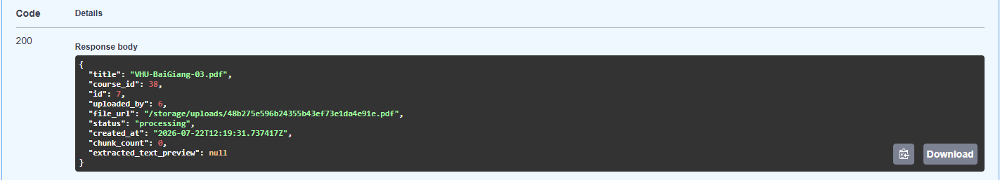
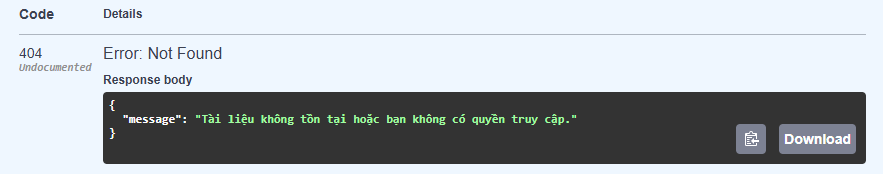
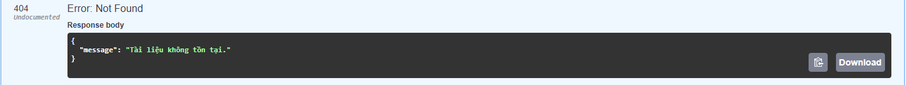

# README T021 – Material List/Detail API (Backend)

## Mục tiêu
Triển khai API lấy chi tiết tài liệu học tập (Material Detail) hỗ trợ hiển thị preview nội dung (chữ) của tài liệu và đếm số lượng chunk. Không thay đổi cấu trúc database, đảm bảo kế thừa toàn bộ chức năng từ T019 (bao gồm List API và cơ chế phân quyền).

## API Endpoints

- Danh sách: `GET /api/v1/materials/course/{course_id}`
- Chi tiết: `GET /api/v1/materials/{material_id}`

## Cấu trúc Response Chi tiết (MaterialDetailResponse)
```json
{
  "title": "tài_liệu_1.pdf",
  "course_id": 1,
  "id": 10,
  "uploaded_by": 2,
  "file_url": "/storage/uploads/xxx.pdf",
  "status": "processing",
  "created_at": "2026-07-22T00:00:00Z",
  "chunk_count": 0,
  "extracted_text_preview": null
}
```

## Quy tắc Trích xuất Preview (từ Chunks)
- `chunk_count`: Số lượng chunk được tạo ra từ tài liệu đó trong bảng `chunks`.
- `extracted_text_preview`: 
  - Là nội dung gộp từ các chunk theo thứ tự `chunk_index` tăng dần.
  - Được cắt ngắn ở **1.000 ký tự** đầu tiên (việc cắt chuỗi trên Python đảm bảo không chia rẽ các ký tự Unicode).
  - Trả về `null` nếu chưa có chunk nào. 
- *Lưu ý:* Hiện tại T021 chưa có module chunking thật, do đó `chunk_count: 0` và `extracted_text_preview: null` là kết quả hợp lệ.

## Phân quyền & Bảo mật (Access Control)
- Kế thừa hàm kiểm tra quyền từ `course_service.get_course(..., course_id=...)`.
- **Giảng viên (Lecturer):** Chỉ được xem chi tiết tài liệu thuộc về khóa học mà họ đang làm giảng viên (owner).
- **Quản trị viên (Admin):** Có quyền xem mọi tài liệu bất chấp khóa học.

## Các kịch bản kiểm thử (Test Cases)

1. **Có quyền truy cập:** 
   - Đăng nhập (Admin hoặc Lecturer có sở hữu). Gọi API chi tiết một tài liệu. 
   - Kết quả: `200 OK`, `chunk_count = 0`, `extracted_text_preview = null`.
   
2. **Không có quyền truy cập:** 
   - Đăng nhập bằng Lecturer không phải owner của khóa học chứa tài liệu đó. Gọi API. 
   - Kết quả: `404 Not Found`.
   
3. **Tài liệu không tồn tại:** 
   - Truyền `material_id = 99999`. 
   - Kết quả: `404 Not Found`.
   
4. **Khi đã có chunks thật (Dự phòng tương lai):**
   - Nếu trong database tồn tại chunks liên kết với material, API phải trả về `chunk_count > 0` và đoạn text trích xuất dài tối đa 1.000 ký tự trong field `extracted_text_preview`.
